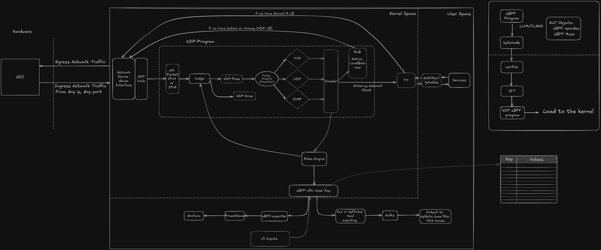

<h1 align="center"> X-Defender 💥 </h1>

**X-Defender** is an advanced [DDoS mitigation](https://www.cloudflare.com/learning/ddos/ddos-mitigation/#:~:text=DDoS%20mitigation%20refers%20to%20the,%2Dservice%20(DDoS)%20attack.) tool built with [eBPF](https://ebpf.io/) and [XDP](https://www.iovisor.org/technology/xdp). It not only filters and limits malicious traffic in real-time but also takes a proactive and aggressive approach to neutralize threats before they impact your network. Leveraging the power of XDP, X-Defender operates at the lowest level of the Linux networking stack, ensuring high performance and minimal latency while effectively countering even the most sophisticated DDoS attacks.

**Note: This project is in progress, and we are actively working on the code**
# Table of Contents

- [Getting Started](https://github.com/SamanKhalife/X-Defender/blob/main/docs/getting-started.md)
- [Architecture Overview](https://github.com/SamanKhalife/X-Defender/blob/main/docs/architecture.md)
- [Running the Tool](https://github.com/SamanKhalife/X-Defender/blob/main/docs/running.md)
- [User Manual](https://github.com/SamanKhalife/X-Defender/blob/main/docs/user-guide.md)
- [Features](https://github.com/SamanKhalife/X-Defender/blob/main/docs/features.md)
- [Developer Guide](https://github.com/SamanKhalife/X-Defender/blob/main/docs/developer-guide.md)
    - [Repository Structure](https://github.com/SamanKhalife/X-Defender/blob/main/docs/repo-tree.md)
    - [Flowchart: How This Tool Works](https://github.com/SamanKhalife/X-Defender/blob/main/docs/flowchart.md)
    - [Ideas and Roadmap](https://github.com/SamanKhalife/X-Defender/blob/main/docs/Idea.md)
    - [XDP and eBPF Resources](https://github.com/SamanKhalife/X-Defender/blob/main/docs/resources-xdp-ebpf.md)


<h3 align="center"> X-Defender Network Topology </h3>




# Why??
As shown in the Packet Flow in [Packet flow in Netfilter and General Networking](https://upload.wikimedia.org/wikipedia/commons/3/37/Netfilter-packet-flow.svg), XDP operates at the earliest point where packets are handled by the network card. This allows X-Defender to intercept and process packets at this initial stage. By implementing DDoS mitigation at this level, you can protect your system efficiently and cost-effectively while minimizing the load on your system. mostly they use xdp for mitigation and for load balancing like in [cloud flare](https://youtu.be/ZQsbYmdMjnw?t=2685) or many other providers and even [Meta](https://about.meta.com/).

Cloud providers employ various techniques to mitigate DDoS attacks, such as using [Anycast networks](https://en.wikipedia.org/wiki/Anycast), Traffic Scrubbing Centers, [Geo-Blocking](https://en.wikipedia.org/wiki/Geo-blocking), [Behavioral Analytics](https://www.radware.com/blog/ddos-protection/2021/05/behavioral-analytics-how-to-secure-user-experience-under-a-ddos-attack/), [Blackholing](https://www.akamai.com/glossary/what-is-blackhole-routing)/Null Routing, and custom load balancers( like [Katran by Facebook](https://github.com/facebookincubator/katran), [GLB by GitHub](https://github.blog/engineering/glb-director-open-source-load-balancer/), Unimog by Cloudflare (Not Open-source), and [Maglev by Google](https://research.google/pubs/maglev-a-fast-and-reliable-software-network-load-balancer/)) These solutions often integrate multiple systems into a single program to provide comprehensive protection.

However, Our current focus is on DDoS mitigation using XDP, which is the most effective approach available. By leveraging XDP’s low-level packet processing capabilities, we can address DDoS attacks at the earliest stage of packet handling. X-Defender, by operating at this foundational level in the network stack, ensures efficient mitigation of DDoS attacks with minimal impact on system performance.


When we mention this, we really mean that. if you want to know more about the dropping performance at each layer, you should read [this blog](https://blog.cloudflare.com/how-to-drop-10-million-packets/) by [@majek](https://github.com/majek)

## How X-defender Really Works

**X-Defender** processes incoming packets at the network interface level using eBPF and XDP. When the rate limit is exceeded or an attack is detected, the tool drops or redirects the malicious packets.

1. **Packet Inspection**: Detects malicious patterns and excessive traffic.
2. **Rate Limiting**: Controls traffic flow based on thresholds and historical data.
3. **Real-Time Decision Making**: Determines packet handling actions to ensure network integrity.
4. **Adaptive Feedback**: Continuously updates rules and limits based on current traffic.
5. **Analytics and Reporting**: Provides detailed traffic analysis and generates reports for ongoing defense optimization.


## Requirements

For running and developing with X-Defender and eBPF, you might also need the following:
- **Linux Kernel with eBPF and XDP Support**: Ensure your system has a kernel version that supports XDP (typically 4.8+).
- **Clang/LLVM**: Required for compiling the eBPF C code.
- **libbpf**: Provides necessary libraries for interacting with eBPF programs.
- **bpftool**: A utility for inspecting and managing eBPF programs and maps.
- **libelf**: Required for handling ELF (Executable and Linkable Format) files, which are used by eBPF programs.
- **bpftrace** (optional but useful): A tool for tracing eBPF programs and debugging.

### Installing Dependencies

To install the required dependencies on Ubuntu, run:

```bash
sudo apt-get update
sudo apt-get install clang llvm libbpf-dev libelf-dev bpftool linux-headers-$(uname -r)
```


## X-Defender Installation

1. Clone the Repository:

    ```bash
    git clone https://github.com/SamanKhalife/X-Defender.git
    cd X-Defender
    ```

2. Build the eBPF Program:

    ```bash
    clang -target bpf -c rate_limit.c -o rate_limit.o
    ```

**Note:** I strive to ensure compatibility with recent Ubuntu versions for OSS builds. For build issues or support with older versions, please open a GitHub issue or submit a pull request.

## Examples of Usage
In our view, the optimal use of this tool is on L4 load balancers or as the first point in your network stack. Deploying it at this level ensures that malicious traffic is dropped before it can impact any upstream services, providing an additional layer of security and performance.

Here are simple examples of using X-Defender. For more detailed information, [please refer to the Examples](https://github.com/SamanKhalife/X-Defender/blob/main/docs/examples.md).


# Intended Use
X-Defender is designed as an advanced DDoS mitigation tool that leverages the capabilities of eBPF and XDP to provide high-performance packet filtering and traffic management at the earliest point of packet processing, directly on the network interface. The primary intended use of X-Defender is to detect and mitigate malicious traffic patterns, such as those seen in DDoS attacks, in real-time, with minimal resource overhead.

## Target Audience
1. **Cloud Service Providers**: For integrating low-level packet filtering to safeguard virtual networks, virtual machines, and other cloud resources from DDoS attacks.
2. **Content Delivery Networks (CDNs)**: To defend against attacks aimed at disrupting their global content distribution capabilities.
3. **Internet Service Providers (ISPs)**: To protect infrastructure from large-scale DDoS attacks and ensure uninterrupted service for their customers.
4. **Large Enterprises**: Especially those in sectors like finance, healthcare, and e-commerce, which are frequent targets of DDoS attacks and require real-time protection to maintain service availability.
5. **Managed Security Service Providers (MSSPs):** To offer advanced DDoS protection services to their clients as part of a comprehensive security portfolio

# License
X-Defender is Dual MIT/GPL licensed.
